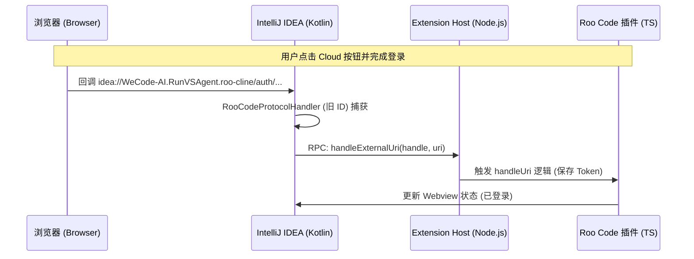

# 设计规划文档：Roo Code Cloud 集成与登录回调桥接优化

## 1. 背景与目标

当前 Roo Code IntelliJ 插件需要集成 **Roo Code Cloud** 功能。为了确保用户现有的模型配置、自定义模式和历史记录不丢失，我们决定**不变更**插件的内部标识符（Extension ID），同时通过自定义协议桥接解决登录回调自动跳转的问题。

**主要目标：**

1. 在插件工具栏集成 Roo Cloud 按钮。
2. **保持插件 ID** 为 `WeCode-AI.RunVSAgent.roo-cline`，确保本地配置零成本平滑保留。
3. 实现自定义协议桥接，支持基于 IDE 原生 Scheme（如 `idea://`）的登录回调。
4. 优化开发环境，允许 IDE 索引子模块源码。

---

## 2. 问题分析

### 2.1 登录回调失效

* 协议冲突：默认使用 `vscode://` 协议会唤起 VS Code 而非 IntelliJ。
* Scheme 配置：旧版硬编码了 `vscode`。需要动态识别当前 IDE 的 Scheme（如 `idea`, `webstorm`, `pycharm`）。
* 回调处理：缺少专门的 `JBProtocolCommand` 来接住浏览器跳回来的 Deep Link。

### 2.2 插件 ID 策略

* 现状：ID 为 `WeCode-AI.RunVSAgent.roo-cline`。
* 决策：**不修改 ID**。修改 ID 会导致存储在 `options/roo-cline-extension-storage.xml` 中的配置因为 Component Name 和 Key 的双重变更而彻底失效。

---

## 3. 详细设计方案

### 3.1 UI 按钮集成

* Action 类：恢复 `CloudButtonClickAction`。
* 布局顺序：在 `plugin.xml` 中将 Cloud 按钮放置在 `History` 之后。

### 3.2 存储与配置 (零迁移方案)

* 保持 ID：`ExtensionManager.kt` 中硬编码 `publisher` 为 `WeCode-AI`，`name` 为 `RunVSAgent.roo-cline`。
* 结果：`ExtensionStorageService` 将继续读写旧的配置条目，用户升级后配置无感保留。

### 3.3 自定义协议桥接 (Deep Link)

* 动态 Scheme：通过 `ExtensionHostManager.getIdeProtocolScheme()` 获取当前 IDE 对应的协议名（如 IntelliJ IDEA 对应 `idea`）。
* 协议处理器 (RooCodeProtocolHandler)：
  * 注册为 `JBProtocolCommand`，监听命令名 `WeCode-AI.RunVSAgent.roo-cline`。
  * 接收回调：`idea://WeCode-AI.RunVSAgent.roo-cline/auth/clerk/callback?code=...`。
* 转发链路：
  1. 处理器捕获请求，将其解析为标准 URI。
  2. 调用 `MainThreadUrls` 将 URI 转发给对应的 Extension Host 句柄（handle）。
  3. Extension Host 内部触发 `roo-code` 的 `handleUri` 逻辑完成登录。

---

## 4. 核心代码逻辑

### 4.1 协议处理器 (RooCodeProtocolHandler.kt)

```kotlin
class RooCodeProtocolHandler : JBProtocolCommand("WeCode-AI.RunVSAgent.roo-cline") {
    override suspend fun executeAndGetResult(target: String?, parameters: Map<String, String>, fragment: String?): JBProtocolCommandResult? {
        // 1. 构造标准 URI
        val extensionId = "WeCode-AI.RunVSAgent.roo-cline"
        val scheme = ExtensionHostManager.getIdeProtocolScheme()
        val uri = URI.create("$scheme://$extensionId/$target?...")

        // 2. 分发给各个项目的 Extension Host
        dispatchUri(extensionId, uri)
        return JBProtocolCommandResult(null)
    }
}
```

### 4.2 动态 Scheme 映射 (ExtensionHostManager.kt)

```kotlin
fun getIdeProtocolScheme(): String {
    val productCode = ApplicationInfo.getInstance().build.productCode
    return when (productCode) {
        "IU", "IC" -> "idea"
        "WS" -> "webstorm"
        "PY" -> "pycharm"
        // ... 其他 IDE 映射
        else -> "idea"
    }
}
```

---

## 5. 业务流程图 (登录回调)



---

## 6. 实施状态

1. **[已完成]** 恢复 Cloud 按钮 Action 注册。
2. **[已完成]** 锁定插件 ID 为 `WeCode-AI.RunVSAgent.roo-cline` 以保护存量配置。
3. **[已完成]** 实现 `ExtensionHostManager.getIdeProtocolScheme()`。
4. **[已完成]** 实现并注册 `RooCodeProtocolHandler`，支持旧 ID 协议捕获。
5. **[已完成]** 完善 `MainThreadUrls.kt` 的 URI 转发闭环。

---

**文档更新日期**：2026-03-20 (Final Decision Reached)
